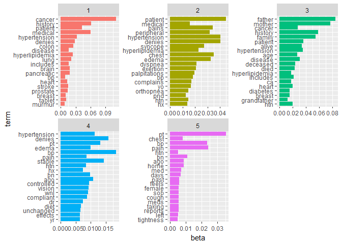
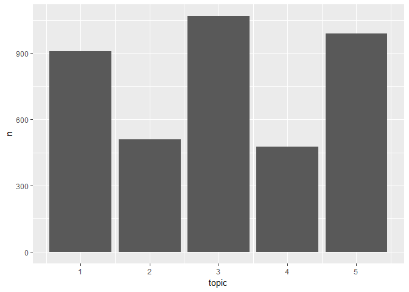
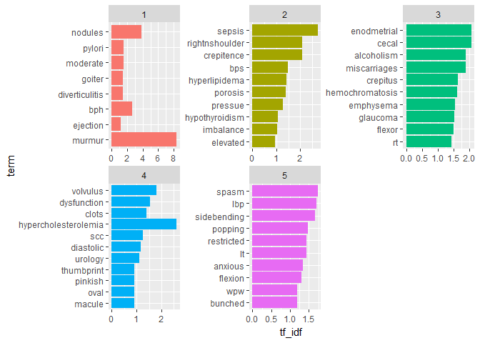
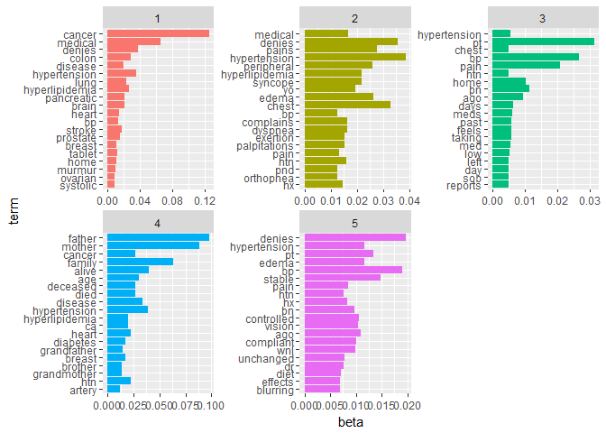

Text Mining and Topic Modeling of Unstructured Notes in Patient Records
================
Pierrette Lo
June 18, 2018

### NOTES

Data: ~21,000 progress notes were extracted from a database of patient records if they contained one or more of the following terms:

-   htn
-   hypertension
-   systolic
-   diastolic
-   bp

The original file (`ProgressNotesHypertension.txt`) consists of three tab-separated columns:

-   Patient\_ID
-   Clinic\_ID
-   ProgressNote

The goal was to use bag-of-words text mining (using the [tidytext](https://www.tidytextmining.com/) package) and topic modeling (using the [topicmodels](https://cran.r-project.org/web/packages/tidytext/vignettes/topic_modeling.html) package) to perform exploratory analyses of this unstructured data.

### SETUP, DATA IMPORT, AND CLEANING

Load packages:

``` r
library(tidyverse)
library(tidytext)
library(topicmodels)
library(stringr)
library(ldatuning)
```

I only did the following quick data cleaning, as my main focus was to experiment with the text mining packages. There is much more that could/should be done to clean up an unstructured dataset.

Pre-cleaning in Unix ([Cygwin](https://www.cygwin.com/) for Windows) to remove `\r` and `\r\n` line breaks that can cause problems in R, such as line breaks in the middle of a table row:

``` bash
# Code not run

# See hidden line endings (^M)

cat -v ProgressNotesHypertension.txt

# Remove ^M (use ctrl-V ctrl-M to type ^M, don't use the caret symbol (shift-6) -- need to retype ctrl-V ctrl-M if copying text from here to cygwin)

sed -e "s/^M//" ProgressNotesHypertension.txt > NotesNoM.txt

## OR use dos2unix program to remove ^M (doesn't remove \r\n) - download from https://sourceforge.net/projects/dos2unix/, extract, move .exe files from bin folder to cygwin bin folder, then do >dos2unix file.txt

# use sed to replace \\r\\n and \\r with --- (s/ = substitute; /g = replace every instance on every line)

sed 's/\\r\\n/---/g' NotesNoM.txt > NotesNoRN.txt

sed 's/\\r/---/g' NotesNoRN.txt > NotesNoRNR.txt
```

Read in the Unix-cleaned document:

``` r
docs <- read_tsv("NotesNoRNR.txt")

# there were 90 parsing failures - output them to a table and check them out:

problems(docs)
unique(problems(docs)$row)
docs[2035,]

# Looks like the problem is caused by \" in 3 rows (2035, 10740, 18560)
# Ignore for now, will fix later
```

Check number of unique patient IDs in this dataset (= 3,949)

``` r
length(unique(docs$Patient_ID))
```

    ## [1] 3949

### SPECIFIC PREP FOR TEXT MINING

Start by unnesting the text into tokens (i.e. words):

``` r
words <- docs %>% 
  unnest_tokens(word, ProgressNote)
```

Remove standalone digits:

``` r
no_numbers <- words %>% 
  filter(is.na(as.numeric(word)))
```

Remove stopwords using the set built into `tidytext` (custom words could be added in future):

``` r
no_stop_words <- no_numbers %>% 
  anti_join(stop_words, by = "word")
```

Create a document-term matrix (rows = documents, or patient records here; columns = terms, or words here) for analysis by `topicmodels`

``` r
# Determine word counts

word_counts <- no_stop_words %>% 
  count(Patient_ID, word) %>%
  ungroup()

# Create document-term matrix

dtm <- word_counts %>% 
  cast_dtm(Patient_ID, word, n)
```

### EXPLORATORY TEXT MINING ANALYSES

Run the latent Dirichlet allocation (LDA) algorithm from the `topicmodels` package, which models a collection of documents as a mixture of topics, and then determines the set of topics most likely to have generated that collection:

``` r
# Start with k = 5 (user must specify number of topics; I arbitrarily chose 5)
# Set seed = 42 (or other number of your choosing) to get reproducible output

words_lda <- LDA(dtm, k = 5, control = list(seed = 42))
```

Tidy the LDA model for further analysis, extracting `beta` (probability of a word being belonging to a particular topic; this is a "fuzzy" method in which a word can belong to more than one topic):

``` r
words_lda_beta <- tidy(words_lda, matrix = "beta")
```

Identify and plot the top 20 terms (by beta) for each topic:

``` r
# top_n includes more than 20 rows if there are ties; would probably be less likely with larger dataset

words_lda_beta %>%
  group_by(topic) %>%
  top_n(20, beta) %>%
  ungroup() %>%
  mutate(term = reorder(term, beta)) %>%
  ggplot(aes(term, beta, fill = factor(topic))) +
  geom_col(show.legend = FALSE) +
  facet_wrap(~ topic, scales = "free") +
  coord_flip()
```



Now tidy the LDA model and extract `gamma`, which is the mixture of topics (and their probabilities) per document:

``` r
words_lda_gamma <- tidy(words_lda, matrix = "gamma")
```

Classify documents by their \#1 main topic (there are too many patients to be able to plot this):

``` r
doc_class <- words_lda_gamma %>% 
  group_by(document) %>% 
  top_n(1, gamma) %>% 
  ungroup() %>% 
  arrange(gamma)
```

Plot number of documents for each main topic:

``` r
doc_class %>% 
  group_by(topic) %>% 
  count() %>%
  ggplot(aes(topic, n)) +
  geom_col()
```



Combine the LDA model with the document-term matrix to see which words were assigned to which topic within each document:

``` r
words_assigned <- augment(words_lda, data = dtm)
```

Perform term frequency-inverse document frequency (TF-IDF) analysis to identify words that are common within a document (TF) and uncommon across all documents (IDF):

``` r
words_assigned_tfidf <- bind_tf_idf(words_assigned, term, document, count)

# Sort by most decreasing mean IDF - i.e. words that are most common among all documents and are therefore least likely to be important

common_words <- words_assigned_tfidf %>% group_by(term) %>% summarize(mean_idf = mean(idf)) %>% arrange(mean_idf)
```

Plot the top 10 most informative terms by topic, according to TF-IDF

``` r
words_assigned_tfidf %>% 
  group_by(.topic) %>% 
  top_n(10, tf_idf) %>% 
  ungroup() %>% 
  mutate(term = reorder(term, tf_idf)) %>% 
  ggplot(aes(term, tf_idf, fill = factor(.topic))) + 
  geom_col(show.legend = FALSE) + 
  facet_wrap(~ .topic, scales = "free") +
  coord_flip()
```



Filter out common words "patient", "history", and "includes" from the corpus; leave "hypertension" since it seems important to interpreting the topics:

``` r
no_common_words <- no_stop_words %>% filter(!grepl("patient", tolower(word)) & !grepl("history", tolower(word)) & !grepl("includes", tolower(word)))
```

Go through the above LDA process again, using the corpus with common words filtered out:

``` r
# Word counts

word_counts_2 <- no_common_words %>% 
  count(Patient_ID, word) %>% 
  ungroup()

# Document-term matrix

dtm2 <- word_counts_2 %>% 
  cast_dtm(Patient_ID, word, n)

# Run LDA

words_lda_2 <- LDA(dtm2, k = 5, control = list(seed = 42))

# Tidy model and extract beta

words_lda_beta_2 <- tidy(words_lda_2, matrix = "beta")

# Plot top 20 terms (by beta) for each topic - marginally more informative than before removal of common words?

words_lda_beta_2 %>%
  group_by(topic) %>%
  top_n(20, beta) %>%
  ungroup() %>%
  mutate(term = reorder(term, beta)) %>%
  ggplot(aes(term, beta, fill = factor(topic))) +
  geom_col(show.legend = FALSE) +
  facet_wrap(~ topic, scales = "free") +
  coord_flip()
```



### FUTURE DIRECTIONS

The number of topics provided to the algorithm needs to be optimized. There are many publications on this topic. I redid the above process using 3, 5, and 8 topics (not shown here) but was unclear on how to compare the results. Expert input will also be required to determine whether the topics are clinically relevant/useful.

A larger number of topics might be more informative, but anything above 8 topics took a prohibitively long time on my computer - parallel processing may be required.

I also tried the [ldatuning](https://cran.r-project.org/web/packages/ldatuning/vignettes/topics.html) package to optimize `k`, but did not have time to fully understand it or interpret the results. Again, large numbers of `k` cause the process to hang.

``` r
# Code not run

optim_k <- FindTopicsNumber(dtm, 
                            topics = seq(from = 2, to = 100, by = 1),
                            metrics = c("Griffiths2004", "CaoJuan2009", "Arun2010"),
                            method = "Gibbs",
                            control = list(seed = 42),
                            mc.cores = 2L,
                            verbose = TRUE)

FindTopicsNumber_plot(optim_k)
```

There is another concept in topic number optimization called "perplexity" that I did not have time to follow up but seems interesting (see References below).

Negation and context are important in EHR text but not considered in bag-of-words text mining. I started to look into using more sophisticated tools such as [MetaMap](https://metamap.nlm.nih.gov/) to or [cTAKES](http://ctakes.apache.org/) to identify negated phrases, etc. Other approaches could improve the consistency and accuracy of our NLP analyses by identifying and standardizing terms and phrases across records - ie. doing a bag-of-CUIs analysis rather than bag of words. This would also help extract concepts from free text for other purposes, such as identifying symptoms/drug effects/etc. for Bayesian analysis; displaying links to relevant PubMed abstracts within a patient record for clinicians' quick reference; and ultimately for use in clinical decision support.

### REFERENCES AND RESOURCES

Various readings on text mining, topic modeling, topic number optimization, and other topics in NLP, in no particular order:

-   [Probabilistic Topic Models](http://www.cs.columbia.edu/~blei/papers/Blei2012.pdf) (good review)
-   [cTAKES](http://ctakes.apache.org/) looks like an interesting NLP system designed by Mayo Clinic researchers specifically for use on EHRs. It is partially based on SPECIALIST and UMLS.
-   [Mayo clinical Text Analysis and Knowledge Extraction System (cTAKES): architecture, component evaluation and applications](https://www.ncbi.nlm.nih.gov/pmc/articles/PMC2995668/)
-   [Word sense disambiguation in the clinical domain: a comparison of knowledge-rich and knowledge-poor unsupervised methods](https://www.ncbi.nlm.nih.gov/pmc/articles/PMC4147600/)
-   [Deep EHR: A Survey of Recent Advances in Deep Learning Techniques for Electronic Health Record (EHR) Analysis](https://arxiv.org/pdf/1706.03446.pdf)
-   [Predicting early psychiatric readmission with natural language processing of narrative discharge summaries](https://www.nature.com/articles/tp2015182)
-   [Natural Language Processing, Electronic Health Records, and Clinical Research](http://people.dbmi.columbia.edu/~chw7007/papers/chapter%2016.pdf)
-   [NLP in R: Topic Modelling](https://www.kaggle.com/rtatman/nlp-in-r-topic-modelling/notebook)
-   [Introduction to LDA](http://blog.echen.me/2011/08/22/introduction-to-latent-dirichlet-allocation/)
-   [Tidy Topic Modelling](https://cran.r-project.org/web/packages/tidytext/vignettes/topic_modeling.html)
-   [Text analysis: fundamentals and sentiment analysis](http://cfss.uchicago.edu/fall2016/text01.html)
-   [i2b2: Informatics for Integrating Biology & the Bedside](https://www.i2b2.org/index.html)
-   [A heuristic approach to determine an appropriate number of topics in topic modeling](https://bmcbioinformatics.biomedcentral.com/articles/10.1186/1471-2105-16-S13-S8)
-   [Topic models: cross validation with loglikelihood or perplexity](https://stackoverflow.com/questions/21355156/topic-models-cross-validation-with-loglikelihood-or-perplexity)
-   <http://freerangestats.info/blog/2017/01/05/topic-model-cv>
-   [Improving the utility of MeSH? terms using the TopicalMeSH representation](https://www.sciencedirect.com/science/article/pii/S1532046416300041)
-   [An automated knowledge-based textual summarization system for longitudinal, multivariate clinical data](https://www.sciencedirect.com/science/article/pii/S1532046416300156)
-   [Using phrases and document metadata to improve topic modeling of clinical reports](https://www.sciencedirect.com/science/article/pii/S1532046416300284)
-   [Redundancy-Aware Topic Modeling for Patient Record Notes](http://journals.plos.org/plosone/article?id=10.1371/journal.pone.0087555)
-   [Using phrases in Mallett topic models](http://www.mimno.org/articles/phrases/)
